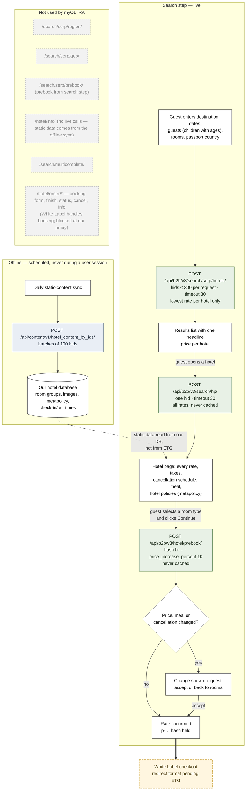

# myOLTRA — ETG endpoints against our flow

**Draft for review, 2026-09-16.** Integration model: Affiliate API, White Label. Certification scope confirmed by ETG: General, Static Data, Search step.

myOLTRA owns discovery (search, hotel page, rate selection, Prebook). Checkout continues in the White Label, which ETG have not yet specified. Our servers never call any booking, payment or order-management endpoint.

## Endpoint summary

| ETG endpoint | Used | Where in our flow | Notes |
|---|---|---|---|
| `/api/b2b/v3/search/serp/hotels/` | **Yes** | Results list (Hotels page, landing summary, concierge result cards) | Our own hotel IDs (`hids`), at most 300 per request (larger sets are split and sent one after another). `residency` and `timeout: 30` sent on every request. Headline price only; no rate is selectable from this response. |
| `/api/b2b/v3/search/region/` (`serp/region`) | No | — | We search our own curated hotel IDs, never a whole region. |
| `/api/b2b/v3/search/serp/geo/` | No | — | Map views use our stored coordinates, and prices come from `serp/hotels` for the hotels shown. |
| `/api/b2b/v3/search/hp/` | **Yes** | Hotel page, when a guest opens a hotel | Full rate list. `residency` and `timeout: 30` sent. Never cached. |
| `/api/b2b/v3/hotel/prebook/` | **Yes** | Guest selects a room type and clicks Continue | Separate step inside search, never part of a booking flow. `price_increase_percent: 10`; every change to price, meal or cancellation is shown before the guest continues. Never cached. |
| `/api/b2b/v3/search/serp/prebook/` | No | — | We prebook only from the hotel page (h- hash). |
| `/api/content/v1/hotel_content_by_ids/` | **Yes, offline** | Daily scheduled sync | Static data is never fetched during a user session. |
| `/api/b2b/v3/hotel/info/` | No live use | — | Replaced by the Content API sync. |
| `/api/b2b/v3/hotel/order/*` | **No** | — | Booking belongs to the White Label. Our forwarding proxy refuses these paths. |

> **Reviewer note (remove before sending):** the static sync runs through the whitelisted proxy but, per §48, its Railway cron service had not been deployed as of the last record. If it is still not deployed, say "scheduled offline sync" only once it is.
